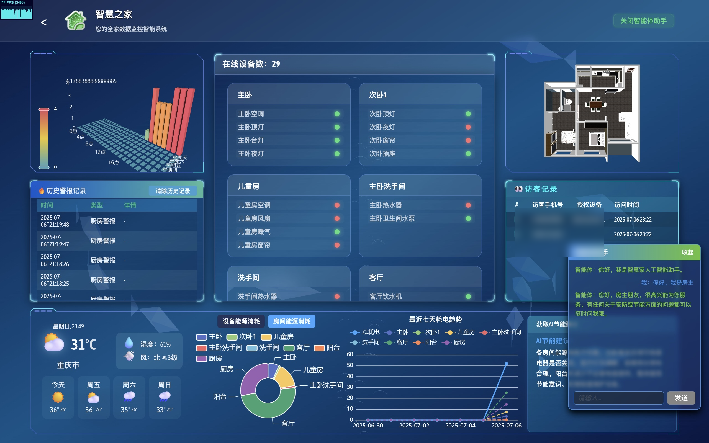

# Smart-Home Data Screen

[English](README.md) | [中文](README.zh-CN.md)

<p align="center">
  
</p>

## Project Overview

Smart-Home Data Screen is a Vue 3 dashboard for monitoring a Smart-Home installation through its live HTTP API. It is the API-backed successor to the historical mock-data dashboard. The published application does not ship a mock runtime or bundled sample telemetry.

## Features

- Live device, scene, alert, and visitor summaries.
- Room-oriented device status cards with online/offline indicators.
- Activity charts computed from the latest API response.
- Automatic refresh every 30 seconds with endpoint-level failure reporting.
- Token and house selection read from browser storage used by the Smart-Home web client.
- Responsive dark dashboard layout for wall displays and desktop browsers.

## Screenshots

The preview above shows the live dashboard layout. Runtime data is loaded from an authenticated Smart-Home API deployment.

## Installation

Requirements: Node.js 22 or newer and npm 11 or newer.

```bash
npm ci
```

The dashboard expects the Smart-Home API to be reachable at the same origin, or through a configured reverse proxy. For a separate API origin, set `VITE_SMARTHOME_API_BASE_URL` before building.

## Usage

```bash
npm run dev
```

Open the printed local URL after configuring a valid Smart-Home session. The API client reads `token` and `houseid` from `localStorage`; it never contains a repository credential.

## Build Instructions

```bash
npm run lint
npm run build
```

The production bundle is written to `dist/`. Do not commit `dist/` unless your deployment process explicitly requires it.

## Project Structure

```text
src/
  components/       Dashboard cards and charts
  router/            Vue Router configuration
  utlis/             Smart-Home API client and response normalization
  views/             Dashboard page
public/              Static entry point and favicon
.github/             CI, CodeQL, Dependabot, and issue templates
```

## Roadmap

- Add configurable chart time windows when the API exposes historical telemetry.
- Add deployment examples for Nginx and containerized static hosting.
- Add component tests for response normalization and partial endpoint failures.

## Contributing

Please read [CONTRIBUTING.md](CONTRIBUTING.md). Use a feature branch and submit a pull request; direct pushes to `main` are not part of the project workflow.

## License

Released under the [MIT License](LICENSE).

## FAQ

### Why is the dashboard empty?

Confirm that the Smart-Home API is reachable, that `localStorage` contains a current `token` and `houseid`, and that the API allows the dashboard origin.

### Is there a mock mode?

No. This repository intentionally contains only the live API implementation. Use a separately controlled test API when developing without a Smart-Home installation.

## Acknowledgements

- Vue 3 and Vite
- Apache ECharts
- Axios

## Disclaimer

This software is provided **AS IS**, without warranty of any kind. The author and contributors are not liable for any direct, indirect, incidental, special, consequential, or other damages arising from the use of this software. You use it at your own risk and are responsible for validating commands, API permissions, data handling, and deployment security. Do not use this software for unlawful activity, unsafe automation, unauthorized access, or any deployment where failure could cause injury or property damage.
